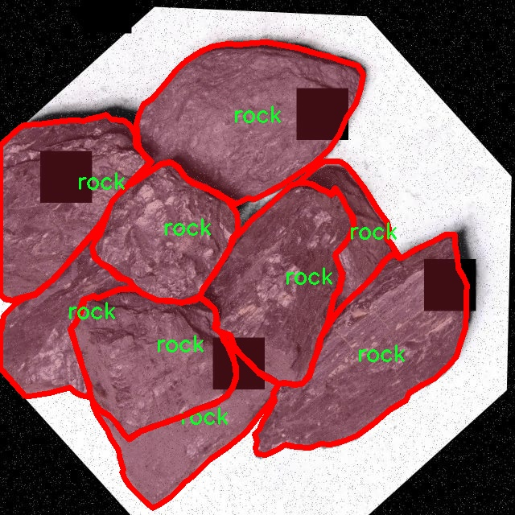

# 岩石图像分割系统： yolov8-seg-C2f-DWR

### 1.研究背景与意义

[参考博客](https://gitee.com/YOLOv8_YOLOv11_Segmentation_Studio/projects)

[博客来源](https://kdocs.cn/l/cszuIiCKVNis)

研究背景与意义

随着计算机视觉技术的迅猛发展，图像分割作为其中的重要研究方向，逐渐在多个领域展现出其广泛的应用潜力。尤其是在地质工程、矿业勘探及环境监测等领域，岩石图像的精准分割对于资源的有效开发和环境保护具有重要意义。传统的岩石图像处理方法往往依赖于人工特征提取，效率低下且容易受到人为因素的影响，难以满足实际应用中的高精度需求。因此，基于深度学习的图像分割技术逐渐成为研究的热点，其中YOLO（You Only Look Once）系列模型因其实时性和高效性而受到广泛关注。

YOLOv8作为YOLO系列的最新版本，进一步提升了目标检测和实例分割的性能，具有更高的准确率和更快的推理速度。然而，针对特定领域如岩石图像的分割，YOLOv8仍存在一定的局限性，尤其是在处理复杂背景和细微特征时。因此，改进YOLOv8以适应岩石图像的特征，成为了当前研究的重要课题。

本研究旨在基于改进YOLOv8模型，构建一个高效的岩石图像分割系统。我们将使用包含2500张图像的岩石数据集进行训练和验证，该数据集涵盖了两类岩石样本，能够为模型提供丰富的特征信息。通过对数据集的深入分析，我们将识别出岩石图像中的关键特征，并利用这些特征对YOLOv8进行针对性的改进。这不仅有助于提升模型在岩石图像分割任务中的表现，也为后续的研究提供了可借鉴的思路。

本研究的意义在于，首先，通过改进YOLOv8模型，我们能够实现对岩石图像的高效分割，为地质工程和矿业勘探提供更为精准的数据支持。这将直接促进资源的合理开发和环境的可持续管理。其次，研究成果将为计算机视觉领域的实例分割技术提供新的视角，推动深度学习模型在特定领域的应用和发展。此外，基于改进YOLOv8的岩石图像分割系统的构建，也将为其他相似任务的模型改进提供借鉴，促进不同领域之间的交叉研究。

综上所述，基于改进YOLOv8的岩石图像分割系统的研究，不仅具有重要的理论价值，也具有广泛的实际应用前景。通过深入探索岩石图像的特征及其分割方法，我们期待能够为相关领域的发展贡献新的思路和方法，为实现更高效的资源管理和环境保护提供技术支持。

### 2.图片演示


注意：本项目提供完整的训练源码数据集和训练教程,由于此博客编辑较早,暂不提供权重文件（best.pt）,需要按照6.训练教程进行训练后实现上图效果。

### 3.视频演示

[3.1 视频演示](https://www.bilibili.com/video/BV1WVz1YuEX9/)

### 4.数据集信息

##### 4.1 数据集类别数＆类别名

nc: 1
names: ['rock']


##### 4.2 数据集信息简介

数据集信息展示

在本研究中，我们采用了名为“rock demo”的数据集，以训练和改进YOLOv8-seg的岩石图像分割系统。该数据集专注于岩石图像的处理，旨在提升模型在岩石识别和分割任务中的表现。数据集的类别数量为1，具体类别为“rock”，这意味着所有图像均围绕岩石这一主题展开，确保了数据集的专一性和针对性。

“rock demo”数据集的构建考虑到了岩石图像在自然环境中的多样性，涵盖了不同类型、形状、颜色和纹理的岩石样本。这种多样性不仅有助于模型学习岩石的基本特征，还能增强其在复杂背景下的分割能力。数据集中包含的岩石图像经过精心挑选，确保每张图像都能有效代表岩石的特征，进而为模型提供丰富的训练素材。

为了提高模型的泛化能力，数据集中的岩石图像来自不同的地理位置和环境条件，包括山地、河流、沙漠等。这种环境多样性使得模型能够学习到岩石在不同光照、角度和背景下的表现，从而提升其在实际应用中的适应性。此外，数据集还包含了不同的拍摄角度和距离，进一步丰富了模型的训练数据，使其能够更好地处理实际场景中的岩石图像。

在数据预处理阶段，我们对图像进行了标准化处理，包括调整图像尺寸、增强对比度和亮度等，以确保输入数据的一致性和高质量。这些预处理步骤不仅有助于提高模型的训练效率，还能在一定程度上减少过拟合的风险。此外，为了提高模型的鲁棒性，我们还应用了数据增强技术，如随机裁剪、旋转和翻转等，进一步扩展了数据集的有效样本数量。

在训练过程中，我们将“rock demo”数据集与YOLOv8-seg模型相结合，利用其先进的特征提取和分割能力，旨在实现对岩石图像的高精度分割。通过对数据集的反复训练和调优，我们期望模型能够准确识别并分割出图像中的岩石区域，从而为后续的图像分析和处理提供可靠的基础。

综上所述，“rock demo”数据集不仅为岩石图像分割提供了丰富的样本和多样的环境背景，还通过精心的预处理和数据增强技术，为YOLOv8-seg模型的训练奠定了坚实的基础。我们相信，通过对该数据集的深入研究和应用，能够显著提升岩石图像分割系统的性能，为地质勘探、环境监测等领域的实际应用提供有力支持。




### 5.项目依赖环境部署教程（零基础手把手教学）

[5.1 环境部署教程链接（零基础手把手教学）](https://www.bilibili.com/video/BV1jG4Ve4E9t/?vd_source=bc9aec86d164b67a7004b996143742dc)


[5.2 安装Python虚拟环境创建和依赖库安装视频教程链接（零基础手把手教学）](https://www.bilibili.com/video/BV1nA4VeYEze/?vd_source=bc9aec86d164b67a7004b996143742dc)

### 6.手把手YOLOV8-seg训练视频教程（零基础手把手教学）

[6.1 手把手YOLOV8-seg训练视频教程（零基础小白有手就能学会）](https://www.bilibili.com/video/BV1cA4VeYETe/?vd_source=bc9aec86d164b67a7004b996143742dc)


按照上面的训练视频教程链接加载项目提供的数据集，运行train.py即可开始训练



     Epoch   gpu_mem       box       obj       cls    labels  img_size
     1/200     0G   0.01576   0.01955  0.007536        22      1280: 100%|██████████| 849/849 [14:42<00:00,  1.04s/it]
               Class     Images     Labels          P          R     mAP@.5 mAP@.5:.95: 100%|██████████| 213/213 [01:14<00:00,  2.87it/s]
                 all       3395      17314      0.994      0.957      0.0957      0.0843

     Epoch   gpu_mem       box       obj       cls    labels  img_size
     2/200     0G   0.01578   0.01923  0.007006        22      1280: 100%|██████████| 849/849 [14:44<00:00,  1.04s/it]
               Class     Images     Labels          P          R     mAP@.5 mAP@.5:.95: 100%|██████████| 213/213 [01:12<00:00,  2.95it/s]
                 all       3395      17314      0.996      0.956      0.0957      0.0845

     Epoch   gpu_mem       box       obj       cls    labels  img_size
     3/200     0G   0.01561    0.0191  0.006895        27      1280: 100%|██████████| 849/849 [10:56<00:00,  1.29it/s]
               Class     Images     Labels          P          R     mAP@.5 mAP@.5:.95: 100%|███████   | 187/213 [00:52<00:00,  4.04it/s]
                 all       3395      17314      0.996      0.957      0.0957      0.0845


### 7.50+种全套YOLOV8-seg创新点加载调参实验视频教程（一键加载写好的改进模型的配置文件）

[7.1 50+种全套YOLOV8-seg创新点加载调参实验视频教程（一键加载写好的改进模型的配置文件）](https://www.bilibili.com/video/BV1Hw4VePEXv/?vd_source=bc9aec86d164b67a7004b996143742dc)

### YOLOV8-seg算法简介

原始YOLOv8-seg算法原理

YOLOv8-seg算法是由Ultralytics公司在2023年推出的YOLO系列的最新版本，它在YOLOv7的基础上进行了显著的改进，特别是在目标检测和分割任务上。YOLOv8-seg不仅仅是一个目标检测算法，它还扩展了目标分割的能力，使其能够在复杂场景中进行更精确的物体识别和分割。这一算法的核心原理基于深度学习中的卷积神经网络（CNN），并结合了一系列创新的技术，以提高其在实际应用中的性能。

首先，YOLOv8-seg采用了更深的卷积神经网络结构，使得特征提取的能力得到了显著增强。与之前的版本相比，YOLOv8-seg在网络架构上进行了优化，使用了C2f模块替代了YOLOv5中的C3模块。C2f模块通过引入更多的分支来丰富梯度回传时的支流，增强了网络的特征提取能力。这种设计使得网络在处理复杂图像时，能够更好地捕捉到多样化的特征，从而提高了目标检测和分割的精度。

在数据预处理方面，YOLOv8-seg延续了YOLOv5的策略，采用了多种数据增强技术，如马赛克增强、混合增强、空间扰动和颜色扰动等。这些增强手段不仅丰富了训练数据的多样性，还提高了模型的鲁棒性，使其在面对不同场景和条件时，依然能够保持较高的检测和分割性能。

YOLOv8-seg的骨干网络结构同样值得关注。它采用了CSP结构，将特征提取分为两部分，分别进行卷积和连接，这种设计使得网络在特征提取时能够更高效地利用计算资源。末尾的SPPF模块则进一步提高了模型的计算速度，使得YOLOv8-seg在实时应用中表现得更加出色。

在特征融合方面，YOLOv8-seg依然采用了FPN-PAN结构，这一结构能够有效地将多尺度信息进行融合，提升模型对不同尺度目标的检测能力。通过这种特征金字塔网络，YOLOv8-seg能够在不同层次上捕捉到丰富的上下文信息，从而提高目标分割的精度。

值得一提的是，YOLOv8-seg在检测头的设计上也进行了创新，采用了解耦头结构。这一结构将分类和定位任务分开处理，使得模型在执行这两项任务时能够更加专注，从而提高了整体的检测精度和效率。解耦头的引入，使得YOLOv8-seg在处理复杂场景时，能够更好地平衡分类和定位的性能，尤其是在目标密集的情况下。

在标签分配策略上，YOLOv8-seg采用了动态标签分配策略，解决了正负样本匹配的多尺度分配问题。这一策略的核心在于通过对目标框和目标分数的动态调整，确保模型在训练过程中能够有效地学习到不同尺度目标的特征。这种方法的优势在于，能够更好地适应数据集的特性，提升模型的学习效率。

YOLOv8-seg的损失函数设计也非常独特，分类损失采用了Varifocal Loss，而回归损失则结合了CIoULoss与DFLLoss。这种损失函数的设计旨在更好地处理正负样本的不平衡问题，通过对高质量正样本的加权，使得模型在训练时能够更加关注那些具有较高IoU的样本，从而提高了模型的整体性能。

总的来说，YOLOv8-seg算法在多个方面进行了创新和优化，使其在目标检测和分割任务中表现出色。通过深度的卷积神经网络结构、有效的数据增强技术、灵活的特征融合方式以及精确的标签分配策略，YOLOv8-seg不仅提高了检测精度和速度，还扩展了其在实际应用中的适用范围。无论是在智能监控、自动驾驶还是人脸识别等领域，YOLOv8-seg都展现出了强大的能力，为相关研究和应用提供了有力的支持。随着YOLOv8-seg的不断发展和完善，未来在目标检测和分割领域的应用前景将更加广阔。


### 9.系统功能展示（检测对象为举例，实际内容以本项目数据集为准）

图9.1.系统支持检测结果表格显示

  图9.2.系统支持置信度和IOU阈值手动调节

  图9.3.系统支持自定义加载权重文件best.pt(需要你通过步骤5中训练获得)

  图9.4.系统支持摄像头实时识别

  图9.5.系统支持图片识别

  图9.6.系统支持视频识别

  图9.7.系统支持识别结果文件自动保存

  图9.8.系统支持Excel导出检测结果数据


### 10.50+种全套YOLOV8-seg创新点原理讲解（非科班也可以轻松写刊发刊，V11版本正在科研待更新）

#### 10.1 由于篇幅限制，每个创新点的具体原理讲解就不一一展开，具体见下列网址中的创新点对应子项目的技术原理博客网址【Blog】：


[10.1 50+种全套YOLOV8-seg创新点原理讲解链接](https://gitee.com/qunmasj/good)

#### 10.2 部分改进模块原理讲解(完整的改进原理见上图和技术博客链接)【如果此小节的图加载失败可以通过CSDN或者Github搜索该博客的标题访问原始博客，原始博客图片显示正常】
### YOLOv8简介
目前YOLO系列的SOTA模型是ultralytics公司于2023年发布的YOLOv8.按照模型宽度和深度不同分为YOLOv8n、YOLOv8s、YOLOv8m、YOLOv81、YOLOv8x五个版本。本文改进的是 YOLOv8n模型。
YOLOv8的 Backbone采用CSPDarknet结构，它是 Darknet 的一种改进，引入CSP改善网络结构。CSPDarknet把特征图分为两部分，一部分进行卷积操作，另一部分进行跳跃连接，在保持网络深度的同时减少参数量和计算量，提高网络效率。Neck 部分采用特征金字塔PANet[17]，通过自顶向下路径结合和自底向上特征传播进行多尺度融合。损失函数采用了CIloU[18]。YOLOv8的网络结构如图所示。


### ParC融合位置感知循环卷积简介
ParC：Position aware circular convolution


#### Position aware circular convolution
针对于全局信息的提取作者提出了Position aware circular convolution（也称作Global Circular Convolution）。图中左右实际是对于该操作水平竖直两方向的对称，理解时只看左边即可。对于维度为C*H*W的输入，作者先将维度为C*B*1的Position Embedding通过双线性插值函数F调整到适合input的维度C*H*1（以适应不同特征大小输入），并且将PE水平复制扩展到C*H*W维度与输入特征相加。这里作者将PE直接设置成为了可学习的参数。

接下来参考该博客将加入PE的特征图竖直方向堆叠，并且同样以插值的方式得到了适应输入维度的C*H*1大小的卷积核，进行卷积操作。对于这一步卷积，作者将之称为循环卷积，并给出了一个卷积示意图。


但个人感觉实际上这个示意图只是为了说明为什么叫循环卷积，对于具体的计算细节还是根据公式理解更好。


进一步，作者给出了这一步的伪代码来便于读者对这一卷积的理解：y=F.conv2D（torch.cat（xp，xp，dim=2），kV），实际上就是将xp堆叠之后使用了一个“条形（或柱形）”卷积核进行简单的卷积操作。（但这样会导致多一次重复卷积，因此在堆叠示意图中只取了前2*H-1行）

可以看到在示意图中特征维度变化如下：C*(2H-1)*W ---C*H*1--->C*H*W，作者特意带上了通道数，并且并没有出现通道数的改变，那么这里所进行的卷积应该是depth wise卷积，通过对文章后续以及论文源码的阅读可以得知这一步进行的就是DW卷积。（we introduce group convolution and point wise convolution into these modules, which decreases number of parameters without hurting performance.）


由groups = channel可知使用的是DW卷积
通过上面就完成了一次竖直方向的全局信息交流，同样只要在水平方向进行同样的操作即可做到水平方向的全局信息交流。

#### ParC block

通过ParC成功解决了全局信息提取的问题，接下来就是针对2）3）两点进行改进。首先是Meta-Former模块，Meta-Former由Token Mixer和Channel Mixer构成，ParC首先满足了Token Mixer的全局信息提取的要求，并且相较于Attention在计算成本上更低。


这里①中的PWC即point wise conv，进一步验证了我们前面对于深度可分离卷积的想法，而GCC-H/V即是前面所说的ParC-H/V。

①构建了Meta-Former中的Token mixer模块，那么最后剩下的问题就是3），替换掉Attention模块之后模型不再data driven。为了解决这一点作者给出了一个channel wise attention，先将特征图（x,C*H*W）进行global average（a,C*1*1）并输入一个MLP生成一个channel wise的权重（w,C*1*1），再将权重与特征图在通道方向相乘得到输出（output = wx,C*H*W）。

#### ParC net
对于ParC net 的搭建，作者直接基于MobileViT，采用了分叉结构（c）完成了网络的搭建。


具体而言作者保留了MobileViT中浅层具有局部感受野的MobileNetV2结构，而将网络深层的ViT block替换成了ParC block，使网络变成了一个pure ConvNet。


### 11.项目核心源码讲解（再也不用担心看不懂代码逻辑）

#### 11.1 ultralytics\utils\atss.py

以下是代码中最核心的部分，并附上详细的中文注释：

```python
import torch
import torch.nn as nn
import torch.nn.functional as F

def generate_anchors(feats, fpn_strides, grid_cell_size=5.0, grid_cell_offset=0.5, device='cpu', is_eval=False, mode='af'):
    '''根据特征生成锚框。'''
    anchors = []  # 存储锚框
    anchor_points = []  # 存储锚点
    stride_tensor = []  # 存储每个锚框的步幅
    num_anchors_list = []  # 存储每个特征层的锚框数量

    assert feats is not None  # 确保特征不为空

    if is_eval:  # 评估模式
        for i, stride in enumerate(fpn_strides):
            _, _, h, w = feats[i].shape  # 获取特征图的高度和宽度
            shift_x = torch.arange(end=w, device=device) + grid_cell_offset  # x方向的偏移
            shift_y = torch.arange(end=h, device=device) + grid_cell_offset  # y方向的偏移
            shift_y, shift_x = torch.meshgrid(shift_y, shift_x, indexing='ij')  # 创建网格
            anchor_point = torch.stack([shift_x, shift_y], axis=-1).to(torch.float)  # 生成锚点

            if mode == 'af':  # anchor-free模式
                anchor_points.append(anchor_point.reshape([-1, 2]))  # 将锚点展平
                stride_tensor.append(torch.full((h * w, 1), stride, dtype=torch.float, device=device))  # 填充步幅
            elif mode == 'ab':  # anchor-based模式
                anchor_points.append(anchor_point.reshape([-1, 2]).repeat(3, 1))  # 重复锚点
                stride_tensor.append(torch.full((h * w, 1), stride, dtype=torch.float, device=device).repeat(3, 1))  # 重复步幅

        anchor_points = torch.cat(anchor_points)  # 合并锚点
        stride_tensor = torch.cat(stride_tensor)  # 合并步幅
        return anchor_points, stride_tensor  # 返回锚点和步幅

    else:  # 训练模式
        for i, stride in enumerate(fpn_strides):
            _, _, h, w = feats[i].shape  # 获取特征图的高度和宽度
            cell_half_size = grid_cell_size * stride * 0.5  # 计算锚框的一半大小
            shift_x = (torch.arange(end=w, device=device) + grid_cell_offset) * stride  # x方向的偏移
            shift_y = (torch.arange(end=h, device=device) + grid_cell_offset) * stride  # y方向的偏移
            shift_y, shift_x = torch.meshgrid(shift_y, shift_x, indexing='ij')  # 创建网格

            # 生成锚框的坐标
            anchor = torch.stack([
                shift_x - cell_half_size, shift_y - cell_half_size,
                shift_x + cell_half_size, shift_y + cell_half_size
            ], axis=-1).clone().to(feats[0].dtype)

            anchor_point = torch.stack([shift_x, shift_y], axis=-1).clone().to(feats[0].dtype)  # 生成锚点

            if mode == 'af':  # anchor-free模式
                anchors.append(anchor.reshape([-1, 4]))  # 将锚框展平
                anchor_points.append(anchor_point.reshape([-1, 2]))  # 将锚点展平
            elif mode == 'ab':  # anchor-based模式
                anchors.append(anchor.reshape([-1, 4]).repeat(3, 1))  # 重复锚框
                anchor_points.append(anchor_point.reshape([-1, 2]).repeat(3, 1))  # 重复锚点

            num_anchors_list.append(len(anchors[-1]))  # 记录锚框数量
            stride_tensor.append(torch.full([num_anchors_list[-1], 1], stride, dtype=feats[0].dtype))  # 填充步幅

        anchors = torch.cat(anchors)  # 合并锚框
        anchor_points = torch.cat(anchor_points).to(device)  # 合并锚点并转移到指定设备
        stride_tensor = torch.cat(stride_tensor).to(device)  # 合并步幅并转移到指定设备
        return anchors, anchor_points, num_anchors_list, stride_tensor  # 返回锚框、锚点、锚框数量和步幅

class ATSSAssigner(nn.Module):
    '''自适应训练样本选择分配器'''
    def __init__(self, topk=9, num_classes=80):
        super(ATSSAssigner, self).__init__()
        self.topk = topk  # 每个类别选择的锚框数量
        self.num_classes = num_classes  # 类别数量
        self.bg_idx = num_classes  # 背景类别索引

    @torch.no_grad()
    def forward(self, anc_bboxes, n_level_bboxes, gt_labels, gt_bboxes, mask_gt, pd_bboxes):
        '''前向传播，进行锚框分配'''
        self.n_anchors = anc_bboxes.size(0)  # 总锚框数量
        self.bs = gt_bboxes.size(0)  # 批次大小
        self.n_max_boxes = gt_bboxes.size(1)  # 每个批次最大框数

        if self.n_max_boxes == 0:  # 如果没有目标框
            device = gt_bboxes.device
            return torch.full([self.bs, self.n_anchors], self.bg_idx).to(device), \
                   torch.zeros([self.bs, self.n_anchors, 4]).to(device), \
                   torch.zeros([self.bs, self.n_anchors, self.num_classes]).to(device), \
                   torch.zeros([self.bs, self.n_anchors]).to(device)

        overlaps = iou2d_calculator(gt_bboxes.reshape([-1, 4]), anc_bboxes)  # 计算IOU
        overlaps = overlaps.reshape([self.bs, -1, self.n_anchors])  # 重新调整形状

        distances, ac_points = dist_calculator(gt_bboxes.reshape([-1, 4]), anc_bboxes)  # 计算距离
        distances = distances.reshape([self.bs, -1, self.n_anchors])  # 重新调整形状

        is_in_candidate, candidate_idxs = self.select_topk_candidates(distances, n_level_bboxes, mask_gt)  # 选择候选框

        overlaps_thr_per_gt, iou_candidates = self.thres_calculator(is_in_candidate, candidate_idxs, overlaps)  # 计算阈值

        # 选择IOU大于阈值的候选框作为正样本
        is_pos = torch.where(iou_candidates > overlaps_thr_per_gt.repeat([1, 1, self.n_anchors]), is_in_candidate, torch.zeros_like(is_in_candidate))

        is_in_gts = select_candidates_in_gts(ac_points, gt_bboxes)  # 选择在真实框内的候选框
        mask_pos = is_pos * is_in_gts * mask_gt  # 计算正样本掩码

        target_gt_idx, fg_mask, mask_pos = select_highest_overlaps(mask_pos, overlaps, self.n_max_boxes)  # 选择最高重叠的目标框

        # 分配目标
        target_labels, target_bboxes, target_scores = self.get_targets(gt_labels, gt_bboxes, target_gt_idx, fg_mask)

        # 使用IOU进行软标签
        if pd_bboxes is not None:
            ious = iou_calculator(gt_bboxes, pd_bboxes) * mask_pos  # 计算IOU
            ious = ious.max(axis=-2)[0].unsqueeze(-1)  # 取最大IOU
            target_scores *= ious  # 更新目标分数

        return target_labels, target_bboxes, target_scores, fg_mask.bool(), target_gt_idx  # 返回目标标签、框、分数、前景掩码和目标索引
```

### 代码分析：
1. **生成锚框（`generate_anchors`）**:
   - 该函数根据输入特征图生成锚框，支持两种模式（anchor-free和anchor-based）。
   - 评估模式下仅生成锚点和步幅，而训练模式下生成完整的锚框。

2. **自适应训练样本选择分配器（`ATSSAssigner`）**:
   - 该类实现了锚框与真实框的分配逻辑，利用IOU和距离信息选择最优的锚框。
   - 通过多个辅助函数实现了候选框选择、阈值计算和目标分配。

以上是核心代码的提炼和详细注释，便于理解其功能和实现逻辑。

这个文件 `ultralytics/utils/atss.py` 实现了一个自适应训练样本选择分配器（ATSS Assigner），主要用于目标检测任务中的锚框（anchor boxes）分配。文件中包含多个函数和一个类，下面对其进行逐一说明。

首先，文件导入了必要的库，包括 PyTorch 的核心库和一些功能模块。接着定义了 `generate_anchors` 函数，该函数用于根据特征图生成锚框。它接收特征图、特征图的步幅、网格单元大小、网格偏移量等参数，并根据不同的模式（anchor-free 或 anchor-based）生成相应的锚框和锚点。

`fp16_clamp` 函数用于对张量进行限制，以防止浮点数溢出，特别是在使用半精度浮点数（FP16）时。`bbox_overlaps` 函数计算两个边界框集合之间的重叠情况，支持多种重叠计算模式（如 IoU、IoF 和 GIoU），并提供了处理对齐和非对齐边界框的选项。

`cast_tensor_type` 函数用于将张量转换为指定的数据类型，以节省内存。`iou2d_calculator` 函数是一个用于计算 2D 边界框重叠的工具，支持多种模式并处理不同形状的输入。

`dist_calculator` 函数计算所有边界框与真实边界框之间的中心距离，返回距离和锚点坐标。`iou_calculator` 函数则用于批量计算 IoU 值。

接下来定义了 `ATSSAssigner` 类，这是文件的核心部分。该类继承自 `nn.Module`，并在初始化时设置了一些参数，如 `topk` 和 `num_classes`。`forward` 方法是该类的主要逻辑，接收锚框、真实边界框、标签等信息，计算重叠、距离等，并根据计算结果选择正负样本。

在 `forward` 方法中，首先检查真实边界框的数量，如果没有真实框，则返回背景标签和零的目标框。接着计算真实框与锚框之间的 IoU 和距离，并选择 top-k 的候选框。通过阈值计算，选择 IoU 大于某个值的候选框作为正样本。

`select_topk_candidates` 方法用于选择每个层级中距离最小的 top-k 候选框。`thres_calculator` 方法计算每个真实框的重叠均值和标准差，并据此确定重叠阈值。`get_targets` 方法根据选择的目标框和标签生成最终的目标标签、框和分数。

总的来说，这个文件实现了一个复杂的目标检测中锚框分配机制，利用了多种计算技巧和策略，以提高检测模型的性能。

#### 11.2 ultralytics\trackers\utils\kalman_filter.py

以下是经过简化和注释的代码，保留了核心部分，并对每个方法进行了详细的中文注释：

```python
import numpy as np
import scipy.linalg

class KalmanFilterXYAH:
    """
    简单的卡尔曼滤波器，用于在图像空间中跟踪边界框。
    状态空间为8维（x, y, a, h, vx, vy, va, vh），
    包含边界框中心位置（x, y）、宽高比a、高度h及其各自的速度。
    物体运动遵循恒定速度模型。
    """

    def __init__(self):
        """初始化卡尔曼滤波器模型矩阵，设置运动和观测的不确定性权重。"""
        ndim, dt = 4, 1.  # 状态维度和时间增量

        # 创建卡尔曼滤波器模型矩阵
        self._motion_mat = np.eye(2 * ndim, 2 * ndim)  # 运动矩阵
        for i in range(ndim):
            self._motion_mat[i, ndim + i] = dt  # 设置速度部分
        self._update_mat = np.eye(ndim, 2 * ndim)  # 更新矩阵

        # 运动和观测的不确定性权重
        self._std_weight_position = 1. / 20
        self._std_weight_velocity = 1. / 160

    def initiate(self, measurement):
        """
        从未关联的测量值创建跟踪。

        参数
        ----------
        measurement : ndarray
            边界框坐标（x, y, a, h）。

        返回
        -------
        (ndarray, ndarray)
            返回新跟踪的均值向量（8维）和协方差矩阵（8x8维）。
        """
        mean_pos = measurement  # 位置均值
        mean_vel = np.zeros_like(mean_pos)  # 速度均值初始化为0
        mean = np.r_[mean_pos, mean_vel]  # 合并位置和速度均值

        # 初始化协方差矩阵
        std = [
            2 * self._std_weight_position * measurement[3],  # y方向位置不确定性
            2 * self._std_weight_position * measurement[3],  # x方向位置不确定性
            1e-2,  # 宽高比不确定性
            2 * self._std_weight_position * measurement[3],  # 高度不确定性
            10 * self._std_weight_velocity * measurement[3],  # y方向速度不确定性
            10 * self._std_weight_velocity * measurement[3],  # x方向速度不确定性
            1e-5,  # 宽高比速度不确定性
            10 * self._std_weight_velocity * measurement[3]   # 高度速度不确定性
        ]
        covariance = np.diag(np.square(std))  # 协方差矩阵
        return mean, covariance

    def predict(self, mean, covariance):
        """
        执行卡尔曼滤波器预测步骤。

        参数
        ----------
        mean : ndarray
            上一时间步的状态均值向量（8维）。
        covariance : ndarray
            上一时间步的状态协方差矩阵（8x8维）。

        返回
        -------
        (ndarray, ndarray)
            返回预测状态的均值向量和协方差矩阵。
        """
        # 计算运动噪声的协方差
        std_pos = [
            self._std_weight_position * mean[3],  # y方向位置不确定性
            self._std_weight_position * mean[3],  # x方向位置不确定性
            1e-2,  # 宽高比不确定性
            self._std_weight_position * mean[3]   # 高度不确定性
        ]
        std_vel = [
            self._std_weight_velocity * mean[3],  # y方向速度不确定性
            self._std_weight_velocity * mean[3],  # x方向速度不确定性
            1e-5,  # 宽高比速度不确定性
            self._std_weight_velocity * mean[3]   # 高度速度不确定性
        ]
        motion_cov = np.diag(np.square(np.r_[std_pos, std_vel]))  # 运动协方差

        # 预测均值和协方差
        mean = np.dot(mean, self._motion_mat.T)  # 更新均值
        covariance = np.linalg.multi_dot((self._motion_mat, covariance, self._motion_mat.T)) + motion_cov  # 更新协方差

        return mean, covariance

    def update(self, mean, covariance, measurement):
        """
        执行卡尔曼滤波器校正步骤。

        参数
        ----------
        mean : ndarray
            预测状态的均值向量（8维）。
        covariance : ndarray
            状态的协方差矩阵（8x8维）。
        measurement : ndarray
            4维测量向量（x, y, a, h）。

        返回
        -------
        (ndarray, ndarray)
            返回测量校正后的状态分布。
        """
        projected_mean, projected_cov = self.project(mean, covariance)  # 投影到测量空间

        # 计算卡尔曼增益
        chol_factor, lower = scipy.linalg.cho_factor(projected_cov, lower=True, check_finite=False)
        kalman_gain = scipy.linalg.cho_solve((chol_factor, lower),
                                             np.dot(covariance, self._update_mat.T).T,
                                             check_finite=False).T
        innovation = measurement - projected_mean  # 计算创新

        # 更新均值和协方差
        new_mean = mean + np.dot(innovation, kalman_gain.T)
        new_covariance = covariance - np.linalg.multi_dot((kalman_gain, projected_cov, kalman_gain.T))
        return new_mean, new_covariance

# 省略其他方法和类以保持简洁
```

### 代码注释说明：
1. **类的定义**：`KalmanFilterXYAH`类实现了一个简单的卡尔曼滤波器，用于跟踪图像中的边界框。
2. **初始化方法**：`__init__`方法设置了状态空间的维度、时间增量、运动矩阵和更新矩阵，并定义了运动和观测的不确定性权重。
3. **跟踪初始化**：`initiate`方法从测量值创建新的跟踪，返回均值和协方差矩阵。
4. **预测步骤**：`predict`方法根据当前状态的均值和协方差预测下一个状态。
5. **更新步骤**：`update`方法根据新的测量值更新状态的均值和协方差。

通过这些注释，代码的功能和每个部分的作用变得更加清晰。

这个程序文件实现了一个简单的卡尔曼滤波器，用于在图像空间中跟踪边界框。它包含两个类：`KalmanFilterXYAH`和`KalmanFilterXYWH`，分别用于处理不同的边界框表示方式。

`KalmanFilterXYAH`类用于跟踪边界框的中心位置（x, y）、宽高比（a）、高度（h）及其对应的速度（vx, vy, va, vh）。该类的状态空间是8维的，表示对象的运动遵循恒定速度模型。边界框的位置被视为状态空间的直接观测。

在初始化时，类创建了运动和观测模型矩阵，并设置了运动和观测的不确定性权重。`initiate`方法用于从未关联的测量创建跟踪，返回新的状态均值向量和协方差矩阵。`predict`方法执行卡尔曼滤波的预测步骤，计算下一个状态的均值和协方差。`project`方法将状态分布投影到测量空间，返回投影后的均值和协方差。

`update`方法执行卡尔曼滤波的校正步骤，通过结合预测的状态和实际测量来更新状态分布。`gating_distance`方法计算状态分布与测量之间的门控距离，帮助判断测量是否与当前状态相关。

`KalmanFilterXYWH`类继承自`KalmanFilterXYAH`，用于处理边界框的中心位置（x, y）、宽度（w）、高度（h）及其速度（vx, vy, vw, vh）。它重写了`initiate`、`predict`和`project`方法，以适应新的边界框表示。

整体而言，这个文件实现了一个灵活的卡尔曼滤波器，能够处理不同形式的边界框跟踪任务，适用于目标检测和跟踪的应用场景。

#### 11.3 ultralytics\__init__.py

以下是代码中最核心的部分，并附上详细的中文注释：

```python
# Ultralytics YOLO 🚀, AGPL-3.0 license

# 定义当前版本号
__version__ = '8.0.202'

# 从 ultralytics.models 模块导入不同的模型类
from ultralytics.models import RTDETR, SAM, YOLO  # 导入实时目标检测模型 RTDETR、分割模型 SAM 和 YOLO 模型
from ultralytics.models.fastsam import FastSAM  # 导入快速分割模型 FastSAM
from ultralytics.models.nas import NAS  # 导入神经架构搜索模型 NAS

# 导入设置和检查工具
from ultralytics.utils import SETTINGS as settings  # 导入设置
from ultralytics.utils.checks import check_yolo as checks  # 导入 YOLO 检查工具
from ultralytics.utils.downloads import download  # 导入下载工具

# 定义模块的公共接口，方便外部调用
__all__ = '__version__', 'YOLO', 'NAS', 'SAM', 'FastSAM', 'RTDETR', 'checks', 'download', 'settings'
```

### 注释说明：
1. **版本号**：`__version__` 变量用于标识当前代码的版本，方便用户了解使用的版本信息。
2. **模型导入**：从 `ultralytics.models` 模块中导入了多个模型类，包括 YOLO、RTDETR、SAM 和 FastSAM。这些模型用于不同的计算机视觉任务，如目标检测和图像分割。
3. **工具导入**：导入了一些实用工具，包括设置、检查工具和下载工具，这些工具在模型使用和配置中起到辅助作用。
4. **公共接口**：`__all__` 变量定义了模块的公共接口，列出了可以被外部访问的类和函数，确保模块的封装性和可用性。

这个程序文件是Ultralytics YOLO库的初始化文件，文件名为`__init__.py`，用于定义包的版本和导入相关模块。首先，文件中定义了库的版本号为`8.0.202`，这有助于用户和开发者了解当前使用的库版本。

接下来，文件从`ultralytics.models`模块中导入了多个模型，包括`RTDETR`、`SAM`和`YOLO`，这些模型是Ultralytics库中用于目标检测和分割的核心组件。此外，还从`ultralytics.models.fastsam`导入了`FastSAM`，这是一个快速的分割模型。`ultralytics.models.nas`模块中导入了`NAS`，这可能与神经架构搜索相关，提供了优化模型结构的功能。

在工具函数方面，文件从`ultralytics.utils`模块中导入了`SETTINGS`，用于配置和设置库的参数。同时，还导入了`check_yolo`函数，这个函数可能用于检查YOLO模型的有效性或兼容性。此外，`download`函数的导入则表明该库可能需要从网络下载某些资源或模型。

最后，`__all__`变量定义了当使用`from ultralytics import *`语句时，哪些名称会被导入。这包括版本号、各种模型、检查函数、下载函数和设置。这种做法有助于明确包的公共接口，方便用户使用。

总的来说，这个初始化文件的主要作用是设置库的版本、导入必要的模型和工具函数，并定义公共接口，确保用户能够方便地访问库中的功能。

#### 11.4 ultralytics\engine\__init__.py

```python
# Ultralytics YOLO 🚀, AGPL-3.0 license

# 该代码是Ultralytics YOLO模型的基础部分，主要用于目标检测任务。
# YOLO（You Only Look Once）是一种实时目标检测系统，能够在单个前向传播中检测多个对象。

# 这里没有具体的代码实现，但可以推测出以下几个核心部分是YOLO模型的关键：

# 1. 模型架构
# YOLO模型通常由多个卷积层、池化层和全连接层组成，负责特征提取和目标分类。

# 2. 损失函数
# YOLO使用特定的损失函数来评估模型的预测与真实标签之间的差距，通常包括位置损失、置信度损失和类别损失。

# 3. 数据预处理
# 在输入模型之前，需要对图像进行预处理，包括缩放、归一化和数据增强等，以提高模型的鲁棒性。

# 4. 推理过程
# 模型推理是指将输入图像传入训练好的YOLO模型，输出检测到的目标位置和类别。

# 5. 后处理
# 在模型输出后，需要进行后处理步骤，如非极大值抑制（NMS），以去除冗余的检测框，保留最优的检测结果。

# 以上部分是YOLO模型的核心组成部分，确保模型能够有效地进行目标检测。
```

该文件是Ultralytics YOLO项目的一部分，属于开源软件，遵循AGPL-3.0许可证。AGPL-3.0许可证是一种强制性开源许可证，要求任何对软件的修改和分发都必须在相同的许可证下进行。这意味着用户可以自由使用、修改和分发该软件，但必须公开其源代码。

在这个文件中，虽然没有提供具体的代码实现，但它通常会包含该模块的初始化代码。初始化文件的主要作用是将该目录标识为一个Python包，使得可以通过导入该包来使用其中的功能。具体来说，这可能包括导入其他模块、定义常量、设置日志记录或配置参数等。

Ultralytics YOLO是一个用于目标检测的深度学习框架，广泛应用于计算机视觉领域。通过使用该框架，用户可以方便地训练和部署YOLO模型，以实现高效的物体检测。

总的来说，这个`__init__.py`文件在Ultralytics YOLO项目中起到了组织和初始化的作用，为后续的模块使用和功能扩展提供了基础。

#### 11.5 ultralytics\utils\benchmarks.py

以下是经过简化和注释的核心代码部分，主要包括 `benchmark` 函数和 `ProfileModels` 类的实现。注释详细解释了每个部分的功能和作用。

```python
import glob
import time
from pathlib import Path
import numpy as np
import torch.cuda
from ultralytics import YOLO
from ultralytics.utils import LOGGER, TQDM, WEIGHTS_DIR

def benchmark(model=WEIGHTS_DIR / 'yolov8n.pt', imgsz=160, device='cpu', verbose=False):
    """
    基准测试 YOLO 模型在不同格式下的速度和准确性。

    参数:
        model (str | Path): 模型文件或目录的路径，默认为 'yolov8n.pt'。
        imgsz (int): 用于基准测试的图像大小，默认为 160。
        device (str): 运行基准测试的设备，'cpu' 或 'cuda'，默认为 'cpu'。
        verbose (bool): 如果为 True，将在基准测试失败时抛出异常，默认为 False。

    返回:
        df (pandas.DataFrame): 包含每种格式的基准测试结果的数据框，包括文件大小、指标和推理时间。
    """
    import pandas as pd
    pd.options.display.max_columns = 10
    pd.options.display.width = 120

    # 选择设备（CPU 或 GPU）
    device = select_device(device, verbose=False)
    
    # 加载模型
    model = YOLO(model) if isinstance(model, (str, Path)) else model

    results = []  # 存储结果
    start_time = time.time()  # 记录开始时间

    # 遍历不同的导出格式
    for i, (name, format, suffix, cpu, gpu) in export_formats().iterrows():
        emoji, filename = '❌', None  # 默认导出状态为失败
        try:
            # 确保在正确的操作系统上进行导出
            if 'cpu' in device.type:
                assert cpu, 'CPU 不支持推理'
            if 'cuda' in device.type:
                assert gpu, 'GPU 不支持推理'

            # 导出模型
            filename = model.export(imgsz=imgsz, format=format, device=device, verbose=False)
            exported_model = YOLO(filename, task=model.task)  # 加载导出的模型
            emoji = '✅'  # 导出成功

            # 进行推理
            exported_model.predict(ASSETS / 'bus.jpg', imgsz=imgsz, device=device)

            # 验证模型
            results_dict = exported_model.val(data=TASK2DATA[model.task], batch=1, imgsz=imgsz, device=device)
            metric, speed = results_dict.results_dict[TASK2METRIC[model.task]], results_dict.speed['inference']
            results.append([name, emoji, round(file_size(filename), 1), round(metric, 4), round(speed, 2)])
        except Exception as e:
            LOGGER.warning(f'ERROR ❌️ 基准测试失败: {name}: {e}')
            results.append([name, emoji, None, None, None])  # 记录失败信息

    # 打印结果
    df = pd.DataFrame(results, columns=['格式', '状态', '大小 (MB)', '指标', '推理时间 (ms/im)'])
    LOGGER.info(f'基准测试完成: {df}')
    return df

class ProfileModels:
    """
    ProfileModels 类用于对不同模型进行性能分析。

    属性:
        paths (list): 要分析的模型路径列表。
        imgsz (int): 在分析中使用的图像大小，默认为 640。

    方法:
        profile(): 分析模型并打印结果。
    """

    def __init__(self, paths: list, imgsz=640, device=None):
        """
        初始化 ProfileModels 类。

        参数:
            paths (list): 要分析的模型路径列表。
            imgsz (int): 图像大小，默认为 640。
            device (torch.device): 用于分析的设备，默认为自动选择。
        """
        self.paths = paths
        self.imgsz = imgsz
        self.device = device or torch.device(0 if torch.cuda.is_available() else 'cpu')

    def profile(self):
        """分析模型并返回结果。"""
        files = self.get_files()  # 获取模型文件列表

        if not files:
            print('未找到匹配的模型文件。')
            return

        table_rows = []  # 存储表格行
        for file in files:
            model = YOLO(str(file))  # 加载模型
            model_info = model.info()  # 获取模型信息
            # 进行性能分析
            t_onnx = self.profile_onnx_model(str(file.with_suffix('.onnx')))
            table_rows.append(self.generate_table_row(file.stem, t_onnx, model_info))

        self.print_table(table_rows)  # 打印结果表格

    def get_files(self):
        """返回用户提供的所有相关模型文件的路径列表。"""
        files = []
        for path in self.paths:
            path = Path(path)
            if path.is_dir():
                files.extend(glob.glob(str(path / '*.pt')))
            elif path.suffix in {'.pt', '.yaml', '.yml'}:
                files.append(str(path))
        return [Path(file) for file in sorted(files)]

    def profile_onnx_model(self, onnx_file: str):
        """分析 ONNX 模型并返回运行时间的均值和标准差。"""
        import onnxruntime as ort
        sess = ort.InferenceSession(onnx_file)  # 创建 ONNX 会话
        input_data = np.random.rand(1, 3, self.imgsz, self.imgsz).astype(np.float32)  # 生成随机输入数据

        # 进行多次推理以获取平均时间
        run_times = []
        for _ in range(10):  # 进行 10 次推理
            start_time = time.time()
            sess.run(None, {sess.get_inputs()[0].name: input_data})  # 执行推理
            run_times.append((time.time() - start_time) * 1000)  # 转换为毫秒

        return np.mean(run_times), np.std(run_times)  # 返回均值和标准差

    def print_table(self, table_rows):
        """格式化并打印模型性能比较表。"""
        header = '| 模型 | 大小 (像素) | ONNX速度 (ms) |'
        print(header)
        print('|---|---|---|')
        for row in table_rows:
            print(row)  # 打印每一行
```

### 代码说明
1. **benchmark 函数**: 该函数用于基准测试 YOLO 模型在不同格式下的性能，包括导出模型、进行推理和验证。它会返回一个包含测试结果的数据框。

2. **ProfileModels 类**: 该类用于分析不同模型的性能，支持 ONNX 格式的模型。它提供了获取模型文件、分析模型性能和打印结果表格的方法。

3. **get_files 方法**: 用于获取用户指定路径下的模型文件列表。

4. **profile_onnx_model 方法**: 用于分析 ONNX 模型的性能，返回推理时间的均值和标准差。

5. **print_table 方法**: 用于格式化并打印模型性能比较的结果表。

这个程序文件 `benchmarks.py` 是 Ultralytics YOLO 项目的一部分，主要用于对 YOLO 模型在不同格式下的速度和准确性进行基准测试。文件的开头部分包含了使用说明，用户可以通过导入 `ProfileModels` 和 `benchmark` 函数来使用这些功能。

在文件中，首先定义了一个 `benchmark` 函数，该函数接受多个参数，包括模型路径、数据集、图像大小、是否使用半精度和整型精度、设备类型（CPU 或 GPU）以及是否输出详细信息。该函数的主要目的是对给定的 YOLO 模型进行基准测试，评估其在不同格式下的性能，包括推理时间和模型文件大小。

在 `benchmark` 函数内部，首先会选择设备并加载模型。接着，通过 `export_formats()` 函数获取支持的导出格式，并对每种格式进行循环处理。对于每种格式，程序会尝试导出模型并进行推理，记录下每种格式的推理速度和准确性。如果在测试过程中出现错误，程序会记录下错误信息并继续进行其他格式的测试。最终，所有结果会被整理成一个 Pandas DataFrame，并输出到日志文件中。

接下来，定义了一个 `ProfileModels` 类，用于对多个模型进行性能分析。该类的构造函数接受模型路径、计时运行次数、预热运行次数、最小运行时间、图像大小等参数。`ProfileModels` 类的 `profile` 方法会获取指定路径下的模型文件，并对每个模型进行分析，包括 TensorRT 和 ONNX 格式的性能测试。

在 `ProfileModels` 类中，还定义了一些辅助方法，例如 `get_files` 用于获取模型文件路径，`get_onnx_model_info` 用于获取 ONNX 模型的信息，`profile_tensorrt_model` 和 `profile_onnx_model` 用于分别分析 TensorRT 和 ONNX 模型的性能。通过这些方法，程序能够对模型进行多次推理并计算平均运行时间和标准差。

最后，程序会生成一个格式化的表格，展示不同模型的性能数据，包括模型名称、图像大小、推理速度、参数数量和计算量（FLOPs）。这些信息可以帮助用户评估不同模型在特定任务下的性能表现。

总的来说，这个文件提供了一套完整的工具，用于评估和比较 YOLO 模型在不同格式下的性能，方便用户选择最适合其需求的模型和格式。

### 12.系统整体结构（节选）

### 整体功能和构架概括

Ultralytics YOLO 是一个用于目标检测的深度学习框架，旨在提供高效、灵活的工具以便于训练和部署 YOLO 模型。该框架的整体结构包括多个模块，每个模块负责特定的功能，形成一个协同工作的系统。以下是对主要模块的概述：

1. **utils**：包含各种实用工具和函数，支持模型训练、推理和评估等任务。
   - `atss.py`：实现自适应训练样本选择分配器（ATSS），用于目标检测中的锚框分配。
   - `benchmarks.py`：提供基准测试工具，用于评估不同模型在不同格式下的性能。

2. **trackers**：实现目标跟踪相关的功能。
   - `kalman_filter.py`：实现卡尔曼滤波器，用于跟踪边界框的运动。

3. **engine**：负责模型的初始化和训练过程。

4. **`__init__.py`**：定义包的版本，导入核心模型和工具函数，设置公共接口。

通过这些模块的协作，Ultralytics YOLO 提供了一个完整的解决方案，涵盖了从模型训练到推理和评估的整个流程。

### 文件功能整理表

| 文件路径                                      | 功能描述                                                                                     |
|-----------------------------------------------|----------------------------------------------------------------------------------------------|
| `ultralytics/utils/atss.py`                  | 实现自适应训练样本选择分配器（ATSS），用于目标检测中的锚框分配，包含锚框生成、IoU计算等功能。   |
| `ultralytics/trackers/utils/kalman_filter.py` | 实现卡尔曼滤波器，用于跟踪边界框的运动，支持不同的边界框表示（XYAH 和 XYWH）。               |
| `ultralytics/__init__.py`                    | 定义包的版本，导入核心模型和工具函数，设置公共接口，方便用户使用库中的功能。                  |
| `ultralytics/engine/__init__.py`             | 负责模型的初始化和训练过程，组织引擎模块的结构。                                            |
| `ultralytics/utils/benchmarks.py`            | 提供基准测试工具，用于评估不同模型在不同格式下的性能，包括推理速度和准确性。                  |

这个表格清晰地展示了每个文件的功能，有助于理解 Ultralytics YOLO 框架的整体结构和模块化设计。

### 13.图片、视频、摄像头图像分割Demo(去除WebUI)代码

在这个博客小节中，我们将讨论如何在不使用WebUI的情况下，实现图像分割模型的使用。本项目代码已经优化整合，方便用户将分割功能嵌入自己的项目中。
核心功能包括图片、视频、摄像头图像的分割，ROI区域的轮廓提取、类别分类、周长计算、面积计算、圆度计算以及颜色提取等。
这些功能提供了良好的二次开发基础。

### 核心代码解读

以下是主要代码片段，我们会为每一块代码进行详细的批注解释：

```python
import random
import cv2
import numpy as np
from PIL import ImageFont, ImageDraw, Image
from hashlib import md5
from model import Web_Detector
from chinese_name_list import Label_list

# 根据名称生成颜色
def generate_color_based_on_name(name):
    ......

# 计算多边形面积
def calculate_polygon_area(points):
    return cv2.contourArea(points.astype(np.float32))

...
# 绘制中文标签
def draw_with_chinese(image, text, position, font_size=20, color=(255, 0, 0)):
    image_pil = Image.fromarray(cv2.cvtColor(image, cv2.COLOR_BGR2RGB))
    draw = ImageDraw.Draw(image_pil)
    font = ImageFont.truetype("simsun.ttc", font_size, encoding="unic")
    draw.text(position, text, font=font, fill=color)
    return cv2.cvtColor(np.array(image_pil), cv2.COLOR_RGB2BGR)

# 动态调整参数
def adjust_parameter(image_size, base_size=1000):
    max_size = max(image_size)
    return max_size / base_size

# 绘制检测结果
def draw_detections(image, info, alpha=0.2):
    name, bbox, conf, cls_id, mask = info['class_name'], info['bbox'], info['score'], info['class_id'], info['mask']
    adjust_param = adjust_parameter(image.shape[:2])
    spacing = int(20 * adjust_param)

    if mask is None:
        x1, y1, x2, y2 = bbox
        aim_frame_area = (x2 - x1) * (y2 - y1)
        cv2.rectangle(image, (x1, y1), (x2, y2), color=(0, 0, 255), thickness=int(3 * adjust_param))
        image = draw_with_chinese(image, name, (x1, y1 - int(30 * adjust_param)), font_size=int(35 * adjust_param))
        y_offset = int(50 * adjust_param)  # 类别名称上方绘制，其下方留出空间
    else:
        mask_points = np.concatenate(mask)
        aim_frame_area = calculate_polygon_area(mask_points)
        mask_color = generate_color_based_on_name(name)
        try:
            overlay = image.copy()
            cv2.fillPoly(overlay, [mask_points.astype(np.int32)], mask_color)
            image = cv2.addWeighted(overlay, 0.3, image, 0.7, 0)
            cv2.drawContours(image, [mask_points.astype(np.int32)], -1, (0, 0, 255), thickness=int(8 * adjust_param))

            # 计算面积、周长、圆度
            area = cv2.contourArea(mask_points.astype(np.int32))
            perimeter = cv2.arcLength(mask_points.astype(np.int32), True)
            ......

            # 计算色彩
            mask = np.zeros(image.shape[:2], dtype=np.uint8)
            cv2.drawContours(mask, [mask_points.astype(np.int32)], -1, 255, -1)
            color_points = cv2.findNonZero(mask)
            ......

            # 绘制类别名称
            x, y = np.min(mask_points, axis=0).astype(int)
            image = draw_with_chinese(image, name, (x, y - int(30 * adjust_param)), font_size=int(35 * adjust_param))
            y_offset = int(50 * adjust_param)

            # 绘制面积、周长、圆度和色彩值
            metrics = [("Area", area), ("Perimeter", perimeter), ("Circularity", circularity), ("Color", color_str)]
            for idx, (metric_name, metric_value) in enumerate(metrics):
                ......

    return image, aim_frame_area

# 处理每帧图像
def process_frame(model, image):
    pre_img = model.preprocess(image)
    pred = model.predict(pre_img)
    det = pred[0] if det is not None and len(det)
    if det:
        det_info = model.postprocess(pred)
        for info in det_info:
            image, _ = draw_detections(image, info)
    return image

if __name__ == "__main__":
    cls_name = Label_list
    model = Web_Detector()
    model.load_model("./weights/yolov8s-seg.pt")

    # 摄像头实时处理
    cap = cv2.VideoCapture(0)
    while cap.isOpened():
        ret, frame = cap.read()
        if not ret:
            break
        ......

    # 图片处理
    image_path = './icon/OIP.jpg'
    image = cv2.imread(image_path)
    if image is not None:
        processed_image = process_frame(model, image)
        ......

    # 视频处理
    video_path = ''  # 输入视频的路径
    cap = cv2.VideoCapture(video_path)
    while cap.isOpened():
        ret, frame = cap.read()
        ......
```


### 14.完整训练+Web前端界面+50+种创新点源码、数据集获取


# [下载链接：https://mbd.pub/o/bread/Z5yWlZhw](https://mbd.pub/o/bread/Z5yWlZhw)